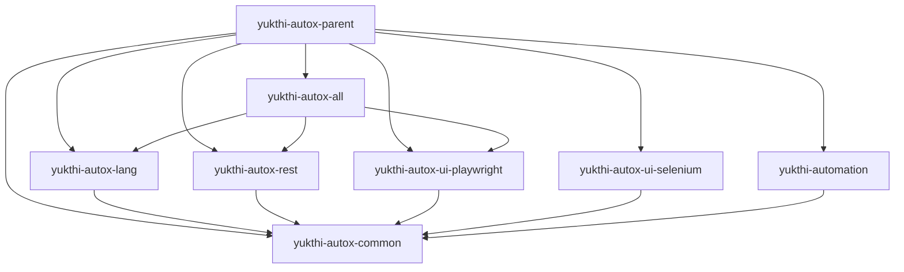

# AutoX Module Structure & UI Drivers

Current Maven layout (AutoX **4.0.0-SNAPSHOT**) and how Playwright / Selenium UI modules fit together.

**Related:** [01-getting-started.md](01-getting-started.md), [08-ui-automation.md](08-ui-automation.md), [reference/plugins.md](reference/plugins.md)

---

## Reactor modules

Parent: `yukthi-autox-parent` (`com.yukthitech:yukthi-autox-parent`).

```text
yukthi-autox-parent
├── yukthi-autox-common          # Core runtime, expressions, shared types
├── yukthi-autox-lang            # Language / control-flow steps
├── yukthi-autox-sql             # RDBMS plugin + steps
├── yukthi-autox-mongo           # MongoDB plugin + steps
├── yukthi-autox-rest            # REST plugin + steps
├── yukthi-autox-ui-playwright   # Playwright UI plugin + ui-* steps (default in all)
├── yukthi-autox-ui-selenium     # Selenium UI plugin + ui-* steps (opt-in)
├── yukthi-autox-webutils        # Webutils helpers
├── yukthi-autox-mail            # Email plugin + steps
├── yukthi-autox-ssh             # SSH plugin + steps
├── yukthi-autox-mock            # HTTP mock server
├── yukthi-autox-all             # Batteries-included POM (includes Playwright, not Selenium)
└── yukthi-autox                 # ArtifactId: yukthi-automation (launcher / core jar)
```



| Artifact | Role |
|----------|------|
| **yukthi-autox-all** | Recommended consumer dependency (`type=pom`). Includes Playwright UI + lang/sql/mongo/rest/mail/ssh/mock/webutils. |
| **yukthi-automation** | Core launcher jar (`AutomationLauncher`). Depends on `yukthi-autox-common`; use with `yukthi-autox-all` (or selected modules) for plugins/steps. |
| **yukthi-autox-ui-playwright** | Default UI stack: `<playwright-plugin>`, Playwright-backed `ui-*` steps. |
| **yukthi-autox-ui-selenium** | Legacy/opt-in UI stack: `<selenium-plugin>`, Selenium-backed `ui-*` steps. |

---

## Choosing a UI driver

| Goal | Dependency | Plugin XML |
|------|------------|------------|
| Default / new projects | `yukthi-autox-all` (or `…-ui-playwright`) | `<playwright-plugin>` |
| Selenium only | `yukthi-autox-ui-selenium` (exclude Playwright) | `<selenium-plugin>` |

**Classpath rule:** only one of `yukthi-autox-ui-playwright` or `yukthi-autox-ui-selenium` may be present. Both register the same `@Executable` names (`uiClick`, …); the runtime fails if both are found.

Test XML locators (`id:`, `xpath:`, `css:`, …) and shared step tags (`ui-click`, `ui-fill-form`, …) stay the same across drivers.

---

## Playwright plugin (default)

```xml
<playwright-plugin maxSessions="3">
    <base-url>#{base.url}</base-url>
    <wrap:drivers>
        <driver name="autoxChrome" browser-type="chromium" default="true" headless="false"/>
    </wrap:drivers>
</playwright-plugin>
```

- Java type: `com.yukthitech.autox.plugin.ui.PlaywrightPlugin`
- Browser types: `chromium`, `firefox`, `webkit`
- Optional driver fields: `channel`, `user-data-dir`, `download-folder`, `extra-arguments`, `slow-mo`, `default-page`
- CLI: `-wd` / `--webdriver` selects a named driver

### Playwright-only steps

| Step | Description |
|------|-------------|
| `s:ui-log-html-snapshot` | MHTML snapshot via CDP (typically Chromium) |
| `s:ui-capture-tracing` | Playwright tracing zip for nested steps |

Details and examples: [08-ui-automation.md](08-ui-automation.md).

---

## Selenium plugin (opt-in)

```xml
<selenium-plugin maxSessions="3">
    <base-url>#{base.url}</base-url>
    <wrap:drivers>
        <driver name="autoxChrome" class-name="com.yukthitech.autox.config.selenium.AutoxChromeDriver">
            <system-property name="webdriver.chrome.driver">./drivers/chromedriver.exe</system-property>
            <profile-option name="chrome.binary">./drivers/chrome.exe</profile-option>
            <extraArguments>--remote-allow-origins=*</extraArguments>
        </driver>
    </wrap:drivers>
</selenium-plugin>
```

- Java type: `com.yukthitech.autox.plugin.ui.SeleniumPlugin`
- Requires local browser driver binaries
- Does **not** provide `ui-log-html-snapshot` or `ui-capture-tracing`

---

## Compatibility notes (Playwright)

- Same `type:value` locators and most `ui-*` / `record-video` steps as Selenium.
- Dialogs are handled via Playwright’s dialog queue (alerts may auto-accept so the click is not blocked).
- Invisible fields may be filled via JS when Playwright’s fill API requires visibility.
- Behavioral differences can still appear for multi-window, frames, downloads, and wait timing — regression-test those paths when switching drivers.

---

## Consumer checklist

1. Depend on `yukthi-autox-all` **4.0.0-SNAPSHOT** (`type=pom`) unless you need a custom module set.
2. Configure `<playwright-plugin>` for UI (not `<selenium-plugin>`, unless you opted into Selenium).
3. Keep suite cleanup with `<s:ui-quit-session/>`.
4. Use Playwright-only steps when you need MHTML or tracing.
5. Never combine both UI modules on the classpath.
