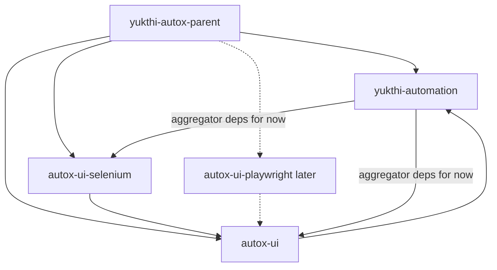

# UI Modularization & Playwright Migration

Reference plan for extracting Autox UI automation into separate Maven modules, introducing a driver abstraction, and later adding Playwright—while keeping existing test XML locators and step names unchanged.

**Status:** Planning / not yet implemented.  
**Related:** [08-ui-automation.md](08-ui-automation.md), [reference/ui-locators.md](reference/ui-locators.md)

---

## Goals

1. **Zero impact on test XML** — locator syntax (`id:`, `xpath:`, `css:`, …), step names (`ui-click`, `ui-fill-form`, …), FreeMarker helpers (`uiValue`, `uiElemAttr`, …), and custom UI locators (`c:…`) stay the same.
2. **Optional UI for consumers** — people who do not need browser automation can eventually depend on core without pulling Selenium/Playwright.
3. **Pluggable drivers** — Selenium today; Playwright later, behind one abstraction in `autox-ui`.

---

## Current baseline (Phase 0)

| Item | Today |
|------|--------|
| UI code | `com.yukthitech.autox.plugin.ui.*` inside `yukthi-automation` |
| Browser API | Selenium 4.x (`selenium-java` on main POM) |
| Drivers | `AutoxChromeDriver`, `AutoxFirefoxDriver` under `config/selenium` |
| Plugin | `SeleniumPlugin` / `SeleniumPluginSession`; XML tag `<selenium-plugin>` |
| Locators | `type:value` via `UiAutomationUtils` → Selenium `By` |
| Coupling | Steps use `WebDriver` / `WebElement` directly; `requiredPluginTypes = SeleniumPlugin.class` |

**Migration goal for tests:** syntactic and step-level compatibility. Config may gain aliases; behavioral differences under Playwright are called out in Phase 2.

---

## Target module layout

```text
yukthi-autox-parent
├── yukthi-automation   (core + aggregator; published artifact consumers use today)
├── autox-ui            (driver-agnostic UI)
├── autox-ui-selenium   (Selenium implementation)
└── autox-ui-playwright (later)
```



| Module | Responsibility | Browser dependency |
|--------|----------------|--------------------|
| **autox-ui** | Steps, assertions, locator parsing, field accessors, FreeMarker UI methods, `IUiDriver` / `IUiSession` / `IUiPage` / `IUiElement`, wait APIs on the abstraction, plugin shape (`UiPlugin`) | None |
| **autox-ui-selenium** | `SeleniumUiDriver`, Selenium plugin/session adapter, `AutoxChromeDriver` / Firefox, `BrowserLogMonitor`, any Selenium-only adapters | `selenium-java` only |
| **autox-ui-playwright** (Phase 2+) | Playwright driver + launch/config | Playwright only |
| **yukthi-automation** | Non-UI Autox + **depends on `autox-ui` and `autox-ui-selenium`** for backward-compatible “batteries included” | Transitive only (no direct `selenium-java`) |

Artifact/folder names: `autox-ui`, `autox-ui-selenium`, `autox-ui-playwright`. The published aggregator remains `yukthi-automation` so existing consumers keep working.

---

## Driver abstraction

```text
Test XML
  → UI Steps / assertions (autox-ui)
      → UiAutomationUtils (parse type:value → IUiLocator)
          → IUiSession / IUiPage / IUiElement
              → SeleniumUiDriver | PlaywrightUiDriver
```

### Preserve (no test XML changes)

- Locator prefixes: `id`, `css`, `class`, `name`, `tag`, `xpath` (and custom `c:`)
- Default bare locator → `name:` (current behavior)
- Step names: `ui-click`, `ui-fill-form`, `ui-goto-page`, …
- FreeMarker: `uiValue`, `uiDisplayValue`, `uiElemAttr`, `uiIsVisible`, …
- Custom UI locators as Autox step sequences (e.g. `srchDropDown`)

### Locator → driver mapping (internal only)

| Autox locator | Typical Playwright / internal selector |
|---------------|----------------------------------------|
| `id: btn` | `#btn` |
| `css: div > a` | `div > a` |
| `class: err` | `.err` |
| `name: save` | `[name="save"]` |
| `tag: button` | `button` |
| `xpath: //…` | `xpath=//…` |

`js:` is documented historically but not fully implemented in `getLocator()` today; do not rely on it for migration success criteria.

---

## Phases

### Phase 1 — Extract + abstract

1. Create **autox-ui** with driver interfaces; move UI steps, assertions, and utils onto them. **No** `org.openqa.selenium` imports in this module.
2. Create **autox-ui-selenium** with Selenium implementations, custom drivers, and Selenium-specific monitors.
3. Update parent POM to a multi-module build; **yukthi-automation** depends on both UI modules; **remove direct `selenium-java` from main**.
4. Keep XML step names and locator syntax unchanged; keep `<selenium-plugin>` working (setter/alias on config or XML `beanType`).
5. Change UI steps to `requiredPluginTypes = UiPlugin.class` (or equivalent), with Selenium registering as that plugin.
6. Reimplement waits (`BaseConditions` / `uiWaitForConditions`) on the abstraction in **autox-ui** (not Selenium `ExpectedConditions`).
7. Regression: existing UI suites still pass on Selenium.

### Phase 2 — Playwright module

1. Add **autox-ui-playwright** implementing the same interfaces.
2. Keep locator mapping in one place in **autox-ui**.
3. Decide whether main also depends on Playwright by default, or consumers opt in.
4. Re-validate high-risk areas: multi-window, frames, alerts/confirm/prompt, downloads, wait timing, drag-and-drop.
5. Rule for dual drivers: **one** UI plugin/session in `app-configuration.xml`—avoid two implementations fighting for the same session.

### Phase 3 — Optional cleanup

1. Prefer `UiPlugin` naming in docs/API while keeping `<selenium-plugin>` (and later `<playwright-plugin>`) as XML aliases.
2. Publish or document a **core-only** dependency path (main without UI deps, or Maven exclusions).
3. Document consumer choices: core-only / selenium / playwright.
4. Drop Selenium when the project is ready.

---

## Phase 1 work checklist (implementation reference)

### Move into `autox-ui` (driver-agnostic)

- `plugin/ui/steps/*`, `plugin/ui/assertion/*`
- `plugin/ui/common/*` (after removing Selenium types)
- Locator types, field accessors, FreeMarker UI methods, prefix UI helpers
- New: `IUiDriver`, `IUiSession`, `IUiPage`, `IUiElement`, `IUiLocator`, `UiPlugin`

### Move into `autox-ui-selenium`

- `SeleniumPlugin`, `SeleniumPluginSession`, `SeleniumDriverConfig`, `SeleniumPluginArgs`
- `config/selenium/*` (`AutoxChromeDriver`, `AutoxFirefoxDriver`, …)
- `BrowserLogMonitor` / `BrowserLogMonitorSession`
- Selenium-backed `IUi*` implementations

### Decouple from core (`yukthi-automation`)

- Prefer generic `addPlugin(IPlugin)` / XML `ccg:beanType` over hard-coded `setSeleniumPlugin` importing UI types
- Replace accidental `org.openqa.selenium.InvalidArgumentException` in non-UI code
- Move or relocate `ValidateAlert` (webutils) with UI modules
- Ensure package scan of `com.yukthitech` still finds steps when UI jars are on the classpath

---

## Problems and risks with this approach

These are real caveats—not reasons to abandon the split.

### 1. Main aggregator still pulls UI

If consumers depend on `yukthi-automation` and it depends on `autox-ui` + `autox-ui-selenium`, they **cannot** exclude UI by default. Phase 1 improves internal structure; true “core only” needs a core artifact without those deps, or documented Maven exclusions.

### 2. Core hard-codes Selenium / UI types today

`ApplicationConfiguration.setSeleniumPlugin` and `addBrowserLogMonitor` import UI types. For a clean split, core must use generic plugin registration, and browser log monitoring must live in **autox-ui-selenium** (or behind a core SPI).

### 3. Wrong dependency direction if steps require `SeleniumPlugin`

Every UI step currently has `requiredPluginTypes = SeleniumPlugin.class`. Steps in **autox-ui** must require a driver-agnostic type (`UiPlugin`). Otherwise **autox-ui** would depend on **autox-ui-selenium** (incorrect).

### 4. Selenium leaks outside `plugin/ui`

- `BrowserLogMonitorSession`
- `ValidateAlert` under `test/webutils`
- Accidental Selenium exceptions in `TestCaseExecutor`, data providers, debug messages  

These must move or be replaced so core does not need `selenium-java`.

### 5. Wait APIs are Selenium-shaped

`BaseConditions` / `WaitForConditionsStep` use `ExpectedConditions`. **Chosen approach:** reimplement on `IUiElement` / session APIs in **autox-ui** so Playwright does not inherit Selenium wait types.

### 6. Dual drivers on the classpath later

If both selenium and playwright modules are present, both may register plugins. Require a single configured UI plugin (or explicit factory selection).

### 7. Package scanning and tooling

Default scan includes `com.yukthitech`. UI steps appear only when UI jars are present—good for exclusion. Doc generation and Prism templates that assume UI is always available need updates when core-only becomes a supported mode.

### 8. Version and publish order

Parent POM must list all modules. Publish order: **autox-ui** → **autox-ui-selenium** → aggregator (`yukthi-automation`).

### 9. Behavioral zero-impact ≠ syntactic

Locators and step XML can stay identical. Under Playwright, windows, dialogs, downloads, and timing may still differ. Treat Phase 2 as a behavioral regression pass, not only a compile/module exercise.

---

## Verdict

**Recommended.** Splitting `autox-ui` / `autox-ui-selenium` / later `autox-ui-playwright` matches an abstraction-first migration and lets consumers eventually choose what to include.

**Expectation setting:** Phase 1 with “main depends on both” preserves today’s UX. It does **not** by itself deliver “exclude UI” until core is usable without those dependencies.

---

## Success criteria

| Criterion | Phase 1 | Phase 2 |
|-----------|---------|---------|
| Existing UI test XML unchanged (locators/steps) | Required | Required |
| No `org.openqa.selenium` in `autox-ui` | Required | Required |
| No direct `selenium-java` on main POM | Required | Required |
| UI suites green on Selenium | Required | — |
| UI suites green on Playwright (or documented gaps) | — | Required |
| Core-only dependency path documented | Nice-to-have | Target for Phase 3 |

---

## Open follow-ups (when implementing)

- Exact Maven `artifactId`s and package roots for the new modules
- Whether `<selenium-plugin>` stays forever as an alias of `UiPlugin`
- Whether Playwright is an opt-in dependency or added to the aggregator by default
- Where UI test resources / HTML fixtures live after the split
- Prism / new-project templates and llm-docs updates for module coordinates
